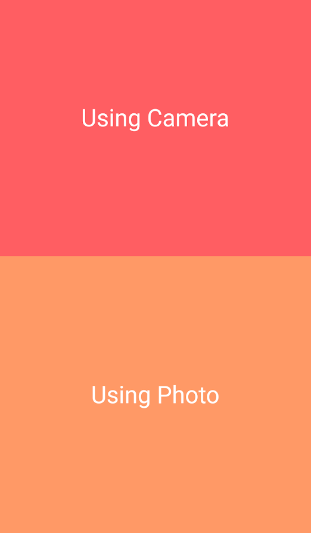
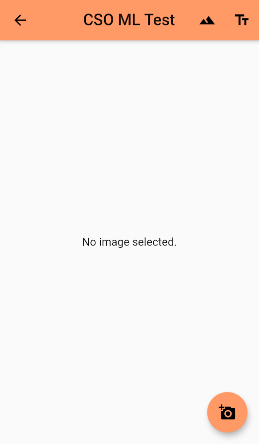
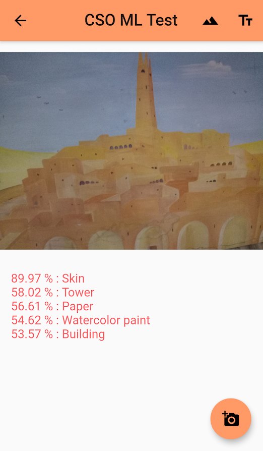

# CSO-ML-Test
This App demonstrates how to use the firebase_ml_vision plugin

------

------

------

## Usage

*Important* If using on-device detectors on `iOS`, see the plugin
[README.md](https://github.com/flutter/plugins/blob/master/packages/firebase_ml_vision/README.md) on including
ML Model pods into the example project.

This example uses the *image_picker* plugin to get images from the device gallery. If using an iOS
device you will have to configure you project with the correct permissions seen under iOS
configuration [here.](https://pub.dartlang.org/packages/image_picker).

## Getting Started

For help getting started with Flutter, view our online
[documentation.](https://flutter.io/)
